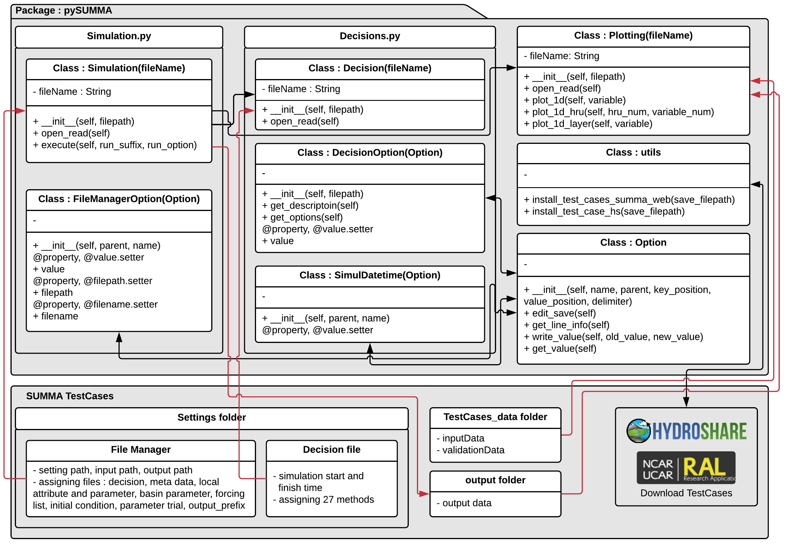

# pySUMMA                                        

The pySUMMA is an Object-Oriented Python wrapper for the manipulation, display and analysis of 
SUMMA model (Structure for Unifying Multiple Modeling Alternatives)
* [SUMMA web site at UCAR ](https://www.rap.ucar.edu/projects/summa)

## The pySUMMA is intended to provide

 - Get and set model parameters and method (fileManager and Decision file) 
 - Run SUMMA Model 
 - Visualize netcdf of SUMMA outputs
 - Operate pySUMMA with jupyter notebook environment 
 - Interact Hydorshare to download SUMMA TestCases and post the output of SUMMA 
 - Automate model calibration or sensitivity analysis (Future work)

## How to run pySUMMA on HydroShare
 1) log in HydoShare(https://www.hydroshare.org)
 2) Start CUAHSI JupyterHub from APPS menu on HydroShare(https://www.hydroshare.org/apps/)
 3) Open "Welcome.ipynb" to download pySUMMA resources from HydroShare
  - run the code "1.How to connect with HydroShare"
  - change the code from "resid = os.environ['HS_RES_ID']" to "resid = 'c1bb4a12bff44bf08c5958cba7947348'". 
 4) You can see the list of Jupyter Notebooks and click one of Jupyter Notebook.
 5) Run one of Jupyter Notebooks.
 <object width="425" height="350">
  <param name="movie" value="https://www.youtube.com/watch?v=pL-LNd474Tw" />
  <param name="wmode" value="transparent" />
  <embed src="https://www.youtube.com/watch?v=pL-LNd474Tw"
         type="application/x-shockwave-flash"
         wmode="transparent" width="425" height="350" />
</object>
  
## How to run pySUMMA locally 
 
### Installation and Usage

#### pySUMMA requires Python 3.6 and following packages :

 - xarray 0.10.0 : N-D labeled arrays and datasets in python
 - numpy 1.13.3 : the fundamental package for scientific computing with Python
 - matplotlib 2.1.1 : a Python 2D plotting library 
 - seaborn 0.8.1 : statistical data visualization 
 - jupyterthemes 0.18.3 : select and install a Jupyter notebook theme
 - hs-restclient 1.2.12 : HydroShare REST API python client library
 - ipyleaflet 0.7.1 : A jupyter widget for dynamic Leaflet maps 
 - Linux Environment (VirtualBox 5.2.8)
   - [lubuntu-16.10 executable](https://www.hydroshare.org/resource/a5dbd5b198c9468387f59f3fefc11e22/)
   - [lubuntu-16.04.4 executable](https://www.hydroshare.org/resource/041671fbc8a544cd8a979af6c2227f92/)        

### Download and Install pySUMMA:

**1.)**  Download pySUMMA
```python
~/Downloads$ git clone https://github.com/uva-hydroinformatics/pysumma.git
```
        
**2.)**  change directory into pysumma folder same level with setup.py.
```python
~/Downloads/pysumma$ pip install .
```

### Examples of unit test :

**a unit test using unittest library**  

```python
~/Downloads/pysumma$ python setup.py test
```
### Examples of manipulating and running pySUMMA :

Refereed paper : Clark, M. P., B. Nijssen, J. D. Lundquist, D. Kavetski, D. E. Rupp, R. A. Woods, 
J. E. Freer, E. D. Gutmann, A. W. Wood, D. J. Gochis, R. M. Rasmussen, D. G. Tarboton, V. Mahat, 
G. N. Flerchinger, D. G. Marks, 2015b: A unified approach for process-based hydrologic modeling: 
Part 2. Model implementation and case studies. Water Resources Research, 
[doi:10.1002/2015WR017200](https://agupubs.onlinelibrary.wiley.com/doi/abs/10.1002/2015WR017200).

**(Test Case-1)** [Modeling the Impact of Stomatal Resistance Parameterizations on Total Evapotranspiration 
         in the Reynolds Mountain East catchment using pySUMMA](notebooks/pySUMMA_Test_Case_1.ipynb) 

**(Test Case-2)** [Modeling the Impact of Root Distributions Parameterizations on Total Evapotranspiration 
         in the Reynolds Mountain East catchment using pySUMMA](notebooks/pySUMMA_Test_Case_2.ipynb)

**(Test Case-3 Evapotranspiration)** [Modeling the Impact of Lateral Flow Parameterizations on Total Evapotranspiration
         in the Reynolds Mountain East catchment using pySUMMA](notebooks/pySUMMA_Test_Case_3_Evapotranspiration.ipynb)

**(Test Case-3 Runoff)** [Modeling the Impact of Lateral Flow Parameterizations on Basin Wide Runoff in the Reynolds 
         Mountain East catchment using pySUMMA](notebooks/pySUMMA_Test_Case_3_Runoff.ipynb)

**(5)** [pySUMMA General Plot example](notebooks/pySUMMA_General_Plot_Example.ipynb)

#### The UML of pySUMMA


## Reference of SUMMA

 - [Document](http://summa.readthedocs.io/en/latest/) : SUMMA documentation is available online and remains a work in progress.
 - [Source Code](https://github.com/NCAR/summa) : NCAR github
 
## Bugs
  Our issue tracker is at https://github.com/uva-hydroinformatics/pysumma/issues.
  Please report any bugs that you find.  Or, even better, fork the repository on
  GitHub and create a pull request.  All changes are welcome, big or small, and we
  will help you make the pull request if you are new to git
  (just ask on the issue).

## License
  Distributed with a MIT license; see LICENSE.txt::

  Copyright (C) 2017 pySUMMA Developers
  YoungDon Choi <yc5ef@virginia.edu>
