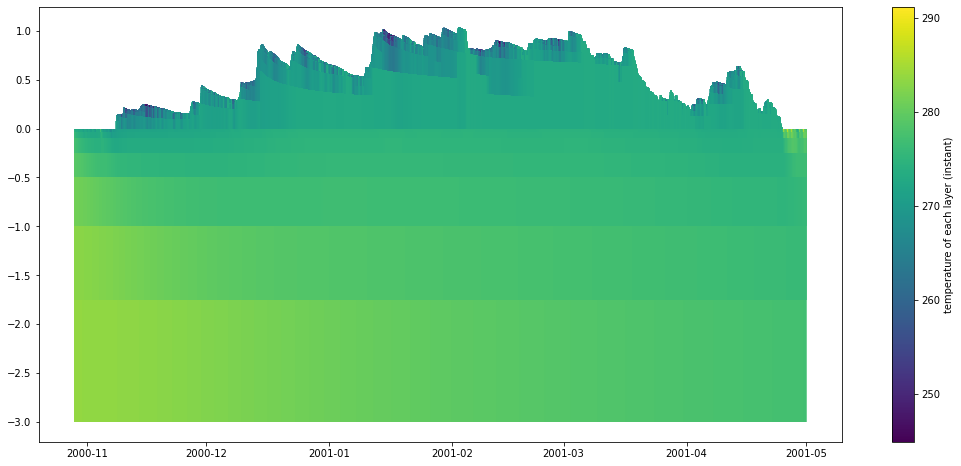
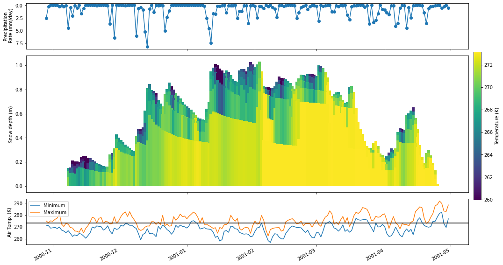
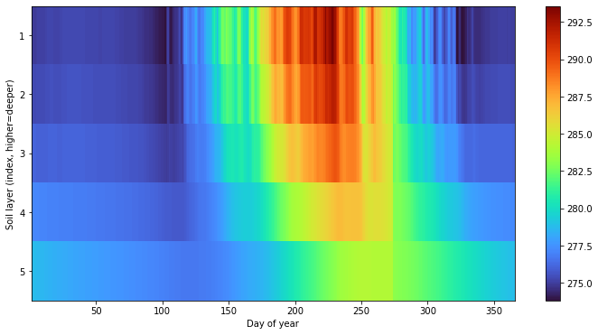
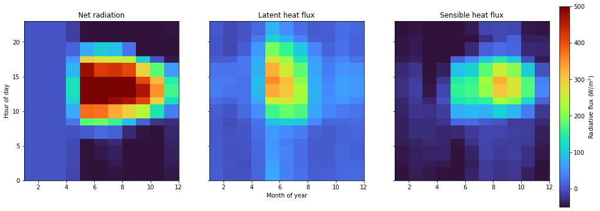
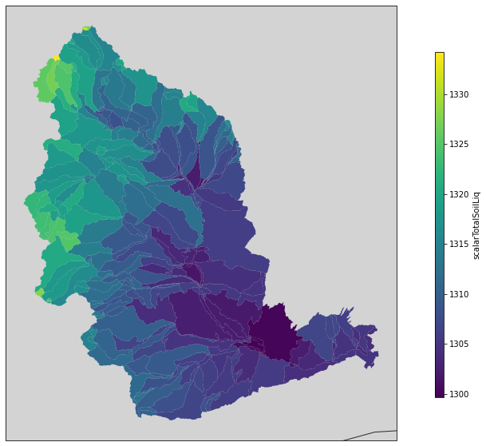

Plotting
========

Introduction
------------

``pysumma`` provides a number of custom plotting functions that can be
useful for basic analysis and diagnostics. These are provided through
the ``pysumma.plotting`` package, which must be imported separately. On
this page we provide some examples of the functionality. Generally,
SUMMA datasets are loaded via
`xarray <http://xarray.pydata.org/en/stable/index.html>`__ and is
interoperable with plotting capabilities from common visualization
packages such as `matplotlib <https://matplotlib.org/>`__ and
`cartopy <https://scitools.org.uk/cartopy/docs/latest/>`__.

A base example
--------------

To demonstrate ``pysumma``\ ’s plotting functionality we’ll run some
base examples which are provided as tutorials. In order to get some data
set up, we will start by importing the required libraries as well as run
an example simulation.

.. code:: ipython3

    %pylab inline
    %load_ext autoreload
    %autoreload 2
    %reload_ext autoreload
    
    import cartopy.crs as ccrs
    import numpy as np
    import matplotlib.pyplot as plt
    import geopandas as gpd
    import warnings
    warnings.filterwarnings('ignore')
    
    import pysumma as ps
    import pysumma.plotting as psp
    ! cd ../../tutorial/data/reynolds && ./install_local_setup.sh && cd -

.. parsed-literal::

    Populating the interactive namespace from numpy and matplotlib
    /home/bzq/workspace/pysumma/docs/notebooks

.. code:: ipython3

    sim = ps.Simulation('summa.exe', '../../tutorial/data/reynolds/file_manager.txt')
    sim.run()
    assert sim.status == 'Success'
    ds = sim.output

Layers plots
------------

The ``psp.layers`` function allows for visualizing timeseries of the
vertically-distributed variables. These variables generally start with
the prefix ``mLayer`` before the rest of the variable name. Here we will
look at the ``mLayerTemp`` variable. In addition to the layered
temperatures we will also need to know where the layer interfaces are.
This is given by the variable ``iLayerHeight``. We can easily select out
these two variables and then input them into the ``psp.layers`` function
with no other arguments.

.. code:: ipython3

    time_range = slice('10-29-2000', '04-30-2001')
    depth    = ds.isel(hru=0).sel(time=time_range)['iLayerHeight']
    temp     = ds.isel(hru=0).sel(time=time_range)['mLayerTemp']
    psp.layers(temp, depth)

.. parsed-literal::

    (<AxesSubplot:>, <matplotlib.cm.ScalarMappable at 0x7f3b452d4050>)

Further customizations and integration with other plots
~~~~~~~~~~~~~~~~~~~~~~~~~~~~~~~~~~~~~~~~~~~~~~~~~~~~~~~

The previous example gives a good first cut of a plot, but it is not
quite publication ready. In this section you will learn how to integrate
the ``psp.layers`` functionality into a more general plotting workflow.
Suppose here that we want only to plot the snow domain at a daily
timescale, along with plots of the daily precipitation and air
temperature.

To do so we will first resample the ``depth`` and ``temp`` variables to
a daily timestep via the ``xarray resample`` method. Then, we will set
up the figure with three subplots. Finally, we will do some
customization on the ``psp.layers`` call. Finally, we’ll add the other
two subplots with the air temperature and precipitation timeseries.

.. code:: ipython3

    # Create the figure
    fig, axes = plt.subplots(3, 1, figsize=(14, 8), gridspec_kw={'height_ratios': [1, 3, 1]}, sharex=True)
    # Add a new axis for the colorbar
    cax = fig.add_axes([0.15, 0.25, 1, 0.55])
    cax.axis('off')
    
    # Calculate the daily values
    depth        = depth.resample({'time': 'D'}).mean()
    temp         = temp.resample({'time': 'D'}).mean()
    precip       = (1000 * ds['pptrate'].isel(hru=0).sel(time=time_range).resample({'time': 'D'}).sum())
    airtemp_mean = ds['airtemp'].isel(hru=0).sel(time=time_range).resample({'time': 'D'}).mean()
    airtemp_max  = ds['airtemp'].isel(hru=0).sel(time=time_range).resample({'time': 'D'}).max()
    airtemp_min  = ds['airtemp'].isel(hru=0).sel(time=time_range).resample({'time': 'D'}).min()
    
    # Do the layers plot
    psp.layers(temp, depth, ax=axes[1], 
               variable_range=[260, 273.15],                                # Set a range for the colors
               line_kwargs={'linewidth': 6},                                # Wider linewidth because we are plotting daily
               cbar_kwargs={'label': 'Temperature (K)', 'ax': cax},  # Colorbar arguments
               plot_soil=False)                                             # Limit to the snow domain
    
    # Add the precip and temperature plots
    precip.plot(ax=axes[0], marker='o')
    airtemp_min.plot(ax=axes[2], label='Minimum')
    airtemp_max.plot(ax=axes[2], label='Maximum')
    axes[2].legend()
    
    # Set some axis labels
    axes[2].axhline(273.16, color='black')
    axes[0].invert_yaxis()
    [a.set_xlabel('') for a in axes]
    [a.set_title('') for a in axes]
    axes[0].set_ylabel('Precipitation\n Rate (mm/day)')
    axes[1].set_ylabel('Snow depth (m)')
    axes[2].set_ylabel('Air Temp. (K)')
    plt.tight_layout()

Hovmöller diagrams
------------------

``pysumma`` also provides some basic support for `Hovmöller
diagrams <https://en.wikipedia.org/wiki/Hovm%C3%B6ller_diagram>`__,
which allow for comparing variables over different coordinates such as
temporal aggregations or spatial dimensions. We first start with a plot
that shows the average soil temperature for each day of year.
Admittedly, this could be calculated and plotted via the ``psp.layers``
function described above, and would show the actual layer depths, but
this gives one example of how this function can mix and match spatial
and temporal dimensions. To do so we do have to pull a trick in
reindexing so that soil layers fall in the last index of the ``midToto``
dimension (``midToto`` being the middle of the layer, rather than the
interfaces which are denoted by ``ifcToto``).

Regardless, we group any ``psp.hovmoller`` call by an ``xdim`` and
``ydim``. Here we include the ``xdim`` as ``dayofyear`` which will
average the temperature for each day of the year over the simulation
period. Similarly, we’ll set the ``ydim`` as ``midToto``, which is the
depth dimension in the output dataset from the SUMMA simulation. We see
here that there are higher frequency oscillations in the upper layers,
as well as a more pronounced seasonal cycle. in the deeper layers we see
a dampened and delayed response.

.. code:: ipython3

    # Reindex so that the bottom layers are the soil layers
    mlayertemp = ds['mLayerTemp'].isel(hru=0)
    mlayertemp.values = psp.utils.justify(mlayertemp.where(mlayertemp > -900).values)
    mlayertemp = mlayertemp.isel(midToto=slice(-6, None))
    
    fig, ax = plt.subplots(figsize=(12, 6))
    psp.hovmoller(mlayertemp, 'dayofyear', 'midToto', ax=ax, colormap='turbo')
    ax.invert_yaxis()
    ax.set_yticks([0.5, 1.5, 2.5, 3.5, 4.5])
    ax.set_yticklabels([1, 2, 3, 4, 5])
    ax.set_ylabel('Soil layer (index, higher=deeper)')
    ax.set_xlabel('Day of year')

.. parsed-literal::

    Text(0.5, 0, 'Day of year')

Further customizations
~~~~~~~~~~~~~~~~~~~~~~

As with the ``psp.layers`` function you can tie in the ``psp.hovmoller``
functionality with the broader Python plotting ecosystem. For example,
let’s look at how the net radiation is partitioned to latent and
sensible heat. In this case we’ll aggregate over two temporal dimensions
(month of year and hour of day). These are specified by the ``xdim`` and
``ydim`` arguments to the ``psp.hovmoller`` function. Valid time grouper
dimensions include
``year, month, day, hour, minute, dayofyear, week, dayofweek, and quarter``.

.. code:: ipython3

    fig, axes = plt.subplots(1, 3, figsize=(16, 5), sharex=True, sharey=True)
    time_range = slice('01-01-2001', '01-01-2002')
    netrad = ds['scalarNetRadiation'].isel(hru=0).sel(time=time_range)
    latheat = -ds['scalarLatHeatTotal'].isel(hru=0).sel(time=time_range)
    senheat = -ds['scalarSenHeatTotal'].isel(hru=0).sel(time=time_range)
    
    # Colorbar axis
    cax = fig.add_axes([0.15, 0.0, 0.9, 0.95])
    cax.axis('off')
    
    # Range for colormap
    vrange = [-50, 500]
    
    psp.hovmoller(netrad,  'month', 'hour', variable_range=vrange, colormap='turbo', ax=axes[0], add_colorbar=False)
    psp.hovmoller(latheat, 'month', 'hour', variable_range=vrange, colormap='turbo', ax=axes[1], add_colorbar=False)
    psp.hovmoller(senheat, 'month', 'hour', variable_range=vrange, colormap='turbo', ax=axes[2], cbar_kwargs={'ax': cax, 'label': 'Radiative flux ($W/m^2$)'})
    
    axes[1].set_xlabel('Month of year')
    axes[0].set_ylabel('Hour of day')
    axes[0].set_title('Net radiation')
    axes[1].set_title('Latent heat flux')
    axes[2].set_title('Sensible heat flux')

.. parsed-literal::

    Text(0.5, 1.0, 'Sensible heat flux')

Spatial plots
-------------

``pysumma`` also offers some basic plotting capabilities for spatially
distributed runs, provided you are able to also supply a shapefile
describing the geometry of the simulation domain. To demonstrate this
capability we will need to set up and run a ``ps.Distributed``
simulation. For more details on the usage of ``ps.Distributed`` see the
associated documents. To do this, we’ll instantiate a ``ps.Distributed``
object with the example data from the Yakima river basin in the Pacific
Northwestern United States.

The simulation itself may take some time to run, and once finished we
will use the ``merge_output`` method to merge all of the simulations
together and get a complete dataset from the simulation. Then we can
plot the spatial fields using ``psp.spatial``. This function takes
either a single time slice or an aggregation over the simulation time
period. In this case we’ll just take the mean of the input air
temperature.

.. code:: ipython3

    !cd ../../tutorial/data/yakima && ./install_local_setup.sh && cd -
    
    shapefile = '../../tutorial/data/yakima/shapefile/yakima.shp'
    file_manager = '../../tutorial/data/yakima/file_manager.txt'
    gdf = gpd.GeoDataFrame.from_file(shapefile)
    yakima = ps.Distributed('summa.exe', file_manager)
    yakima.run()
    assert np.alltrue([s.status == 'Success' for s in yakima.simulations.values()])
    
    yakima_ds = yakima.merge_output()

.. parsed-literal::

    /home/bzq/workspace/pysumma/docs/notebooks

.. code:: ipython3

    fig, ax = plt.subplots(figsize=(10, 10), subplot_kw={'projection':ccrs.Mercator()})
    
    psp.spatial(yakima_ds['airtemp'].mean(dim='time'), gdf, ax=ax)

.. parsed-literal::

    <GeoAxesSubplot:>

